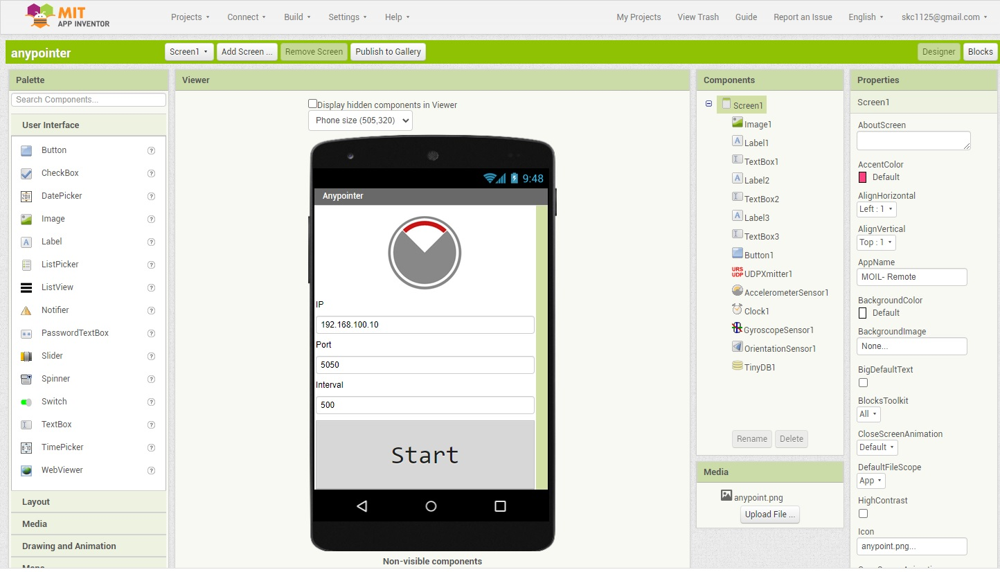
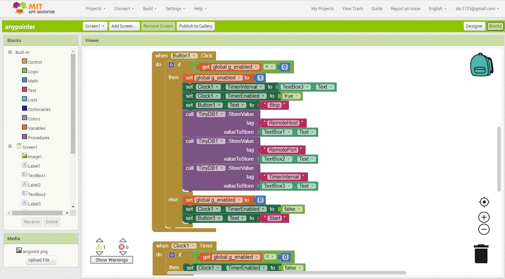

# Anypointer

This is a remote control APP running on Android mobile phone which is used to 

control MOIL anypoint view angle. 

The APP will periodically send UDP socket to the target. please set target IP,

port and interval then press Start button.

## 1. APP 

To install APP on your Android phone please download the apk file at

http://moil.caece.net/apk/anypointer.apk
 
If you are interested in developing your own, please import the above anypointer.aia 

in MIT App Inventor website below

https://appinventor.mit.edu/

## 2. Run MOIL application

Install qt_mainmoil_cuda on your Ubuntu 18.04 or NVIDIA Jetson TX2 to be controlled 

by this APP.

https://github.com/yourskc/qt_mainmoil_cuda_install

Now you can start using the mobile APP.

## 3. Demo Video

https://youtu.be/G7WSd7KJft4

